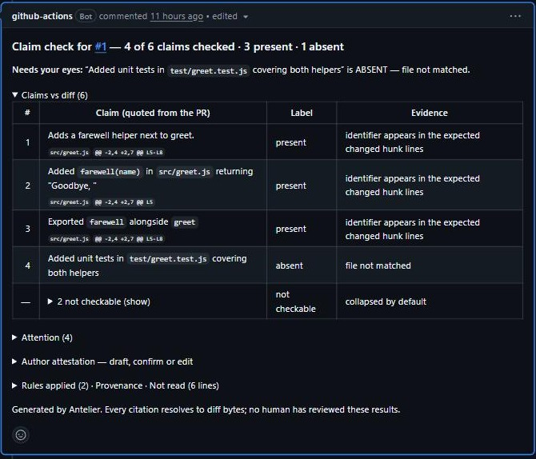

# Antelier

**Local unreleased candidate:** `verify` and `publish` modes add approved browser
journey receipts to the PR comment. See [setup and current limits](EXECUTION-VERIFICATION.md)
and [the workflow template](execution-workflow.example.yml). The existing `v0` tag
does not contain this integration. Live GitHub validation and release are pending.

Checks what an AI coding agent's pull request **claims** against what its diff **actually changed**.

Citations are checked against the fetched diff before rendering. One sticky comment per PR, updated in place on every push, and one Check run. Runs beside your code reviewer, not instead of it.

Any agent, or a human: it checks the pull request, not the tool. Copilot, Claude Code, Codex, Cursor, Devin, Gemini, Jules, Aider and hand-written PRs get the same check; the provenance line names the author when the PR says who it was. Measured on PRs from five different agents.

## Install in one step

Create `.github/workflows/antelier.yml`:

```yaml
name: Antelier claim check
on:
  pull_request:
    types: [opened, synchronize, edited, reopened]
  push:
  issue_comment:
    types: [created]
  pull_request_review_comment:
    types: [created]
permissions:
  contents: read
  pull-requests: write
  checks: write
jobs:
  claim-check:
    if: ${{ github.event_name != 'push' || github.ref_name == github.event.repository.default_branch }}
    runs-on: ubuntu-latest
    steps:
      - uses: actions/checkout@v4
      - uses: antelier/action@v0
```

That is all. No account, no key, no server. The next pull request gets a comment like this:



**How to read it, in ten seconds.** Read the **Needs your eyes** line first: it names the one claim the diff does not back. Open the table only if you disagree. Rows under "context" are sentences about the situation before the change; they are never labelled. A PR whose description makes no checkable claim gets a neutral Check and no comment. Team rules fire regardless of the description.

The headline looks like:

> **Claim check for #42 — 5 of 8 claims checked · 4 present · 1 absent**
> **Needs your eyes:** "Updated the `scripts` block in `package.json` …" is ABSENT — file not matched.

A real example on a six-file Copilot change: [huyn7539/vscode#1](https://github.com/huyn7539/vscode/pull/1) (a fork of microsoft/vscode with the upstream PR replayed onto it).

The headline always says how many of the PR's claims could be decided. Sentences that describe the situation before the change, or why it was made, are context, not claims: they are listed under the table and never labelled.

Each claim in the PR description gets one row and one label:

| Label | Meaning |
|---|---|
| `present` | the described change is in the diff at the cited hunk |
| `partial` | some of it is |
| `absent` | nothing in the diff corresponds |
| `contradicted` | the diff does the opposite of what the description says |
| `not checkable` | cannot be decided from the diff (test runs, CI, performance, intent) |

Claims about test runs, CI results or performance are never guessed. They are shown as not checkable so a person decides.

## Why

Agents write confident PR descriptions. Reviewers read the description first and the diff second, if at all. A description that says "added tests" when the diff added none is the failure this catches. The comment gives the reviewer the one thing to look at before trusting the rest.

## Team rules (v0.4): a correction becomes a rule with a receipt

Reply on any PR, as a collaborator:

```
antelier: forbid `fallback` in packages/next/src/server/**
antelier: require `packages/next/test/**` when packages/next/src/server/** changes
antelier: pair `experimentalFlag` with `docsFlag` in src/**
antelier: never add `retry` here            # "here" = the directories this PR touched
antelier: retract <rule-id>
```

Antelier replies once with a dry run on that PR (would it fire now, cited to the diff) and the YAML block to paste into `.github/antelier/rules.yml`. Committing the file is the adoption; git blame is the provenance. From then on every PR shows, under **Rules applied**, each rule that fired with its citation and who wrote it, and when a later push removes the cause the comment records `fired on <sha>, clear on <sha>`. A fired rule turns the Check action-required. Rules load from the base branch, so a PR cannot disarm the rule it violates. The action never writes to your repository.

## Inputs

| Input | Required | Default | What it does |
|---|---|---|---|
| `data-root` | no | `${{ github.workspace }}` | Directory where the check writes its local evidence (the fetched patch, the rendered comment) during the run. Nothing is written back to the repository. |

No token input: the workflow's own `GITHUB_TOKEN` is used, with the permissions listed below.

## What it needs

Only the workflow's own `GITHUB_TOKEN`. The runner's `gh` CLI reads GitHub and publishes the comment and Check. No model provider receives your source in this build. The GitHub comment can contain quoted claims and source snippets; local evidence stays on the runner.

## What it does not do (yet)

- It does not review code quality or find bugs. Use it beside CodeRabbit, Copilot code review, Greptile or your own reviewers.
- Judged claims (behaviour descriptions with no identifier in the diff) are shown as *not checked* in this build. The deterministic tier decides the rest.
- Author attestation is drafted in the comment. Confirming it needs the Antelier web view, which is not part of this action yet.
- GitHub only today. GitLab is next.
- If the PR has merge conflicts, GitHub runs no pull-request workflows at all, so Antelier stays silent. Resolve the conflict and push.
- On a push to the default branch it posts a Check only (no commit comment), so the workflow never needs `contents: write`.

Measured on 30 external agent PRs (oxc, next.js, home-assistant, vscode and others) against a two-labeller golden set: present precision 0.76, absent precision 1.0, contradicted precision 1.0, fabricated citations 0. Methodology and numbers will be published with each release.

Source-available, run-only license; see LICENSE.md. Feedback: open an issue here.


## Release verification

Build maintainers can reproduce `dist/index.js` with Node 22 and the authorized engine checkout's pinned esbuild 0.28.1:

```sh
node scripts/build.cjs /path/to/engine-checkout
```

The manifest records the engine revision and artifact hash. Test-only modules are excluded. The engine checkout is not part of this distribution.

The execution candidate also bundles `dist/journey-worker.js` and the pinned
Playwright Core 1.61.0 driver under `dist/node_modules/playwright-core`. Its licenses
and notices remain in that directory; those third-party files retain their own
licenses. No browser binary is distributed. The manifest records the worker hash
and a digest of the per-file vendor inventory. Build from a clean output checkout;
the builder refuses to overwrite an existing vendored driver tree.

Citation links open the compared revisions at the cited file; the displayed hunk identifies the relevant source. A linked citation is evidence for that statement, not proof that the application runs correctly.

Fork pull requests normally receive a read-only GitHub token, so this workflow cannot publish comments or Checks there. Do not switch to `pull_request_target` and execute fork code to get around that restriction. Repository policy can also deny writes; inspect the workflow failure before changing permissions. Remove the workflow file to stop future checks; existing GitHub comments remain.
